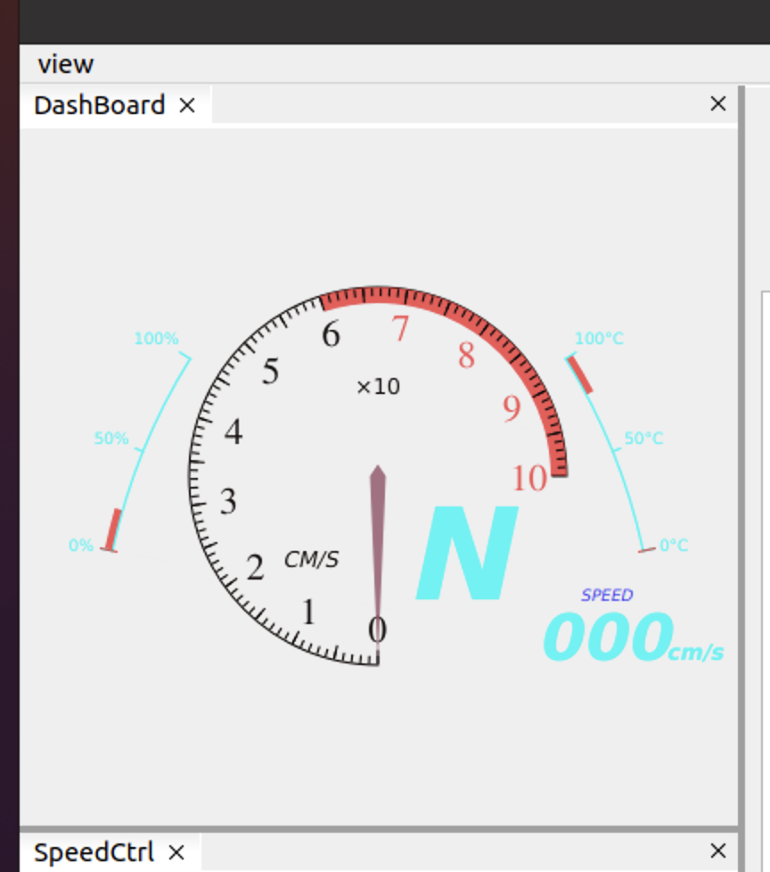

<!--
 * @Author: chengyangkj chengyangkj@qq.com
 * @Date: 2023-09-02 07:23:43
 * @LastEditors: chengyangkj chengyangkj@qq.com
 * @LastEditTime: 2023-10-06 14:03:03
 * @FilePath: /ROS2_Qt5_Gui_App/README.md
-->

## 轻量级ROS1/ROS2移动机器人人机交互软件


<a href="http://qm.qq.com/cgi-bin/qm/qr?_wv=1027&k=mvzoO6tJQtu0ZQYa_itHW7JrT0i4OCdK&authKey=exOT53pUpRG85mwuSMstWKbLlnrme%2FEuJE0Rt%2Fw6ONNvfHqftoWMay03mk1Qi7yv&noverify=0&group_code=797497206">

</a>


<!-- 
<a href="https://www.bilibili.com/video/BV14h4y1w7TC">

</a>
<a href="https://www.bilibili.com/video/BV11h4y1y74H">

</a>
-->

本项目基于Qt5开发，基于Module Cmake进行构建，可以实现一套代码同时在ROS1/ROS2系统中使用

软件在编译时会自动识别环境变量中的ROS1/ROS2环境并进行构建，实现ROS通信与界面隔离

软件所有功能均为自行绘制实现,因此可以轻松运行在一些性能比较低的边缘设备,

目前软件可以实现:

  - 1,ROS1/ROS2通信
  - 2,全局地图显示
  - 3,全局/局部代价地图显示
  - 4,机器人实时位置显示
  - 5,机器人实时速度显示 
  - 6,机器人手动控制
  - 7,机器人重定位
  - 8,机器人导航单点目标发布
  - 9,机器人全局/局部规划轨迹显示
  - 10,机器人拓扑地图功能,多导航点单点导航
  
已规划未实现(TODO List):

  - 1,机器地图编辑器功能
  - 2,机器人拓扑地图多点连续导航/拓扑地图路线绘制
  - 3,机器人导航任务链
  - 4,基于protobuf的通信channel实现(制定自定义通信协议,彻底摆脱ROS通信机制,实现软件跨平台运行)
  - 5,鹰眼视图
  - 6,基于OpenGl的3D视图显示


此仓库国内加速镜像链接:[gitee](https://gitee.com/chengyangkj/Ros_Qt5_Gui_App)

本项目已接入CI,保证多ROS版本/系统版本可用性,持续集成,持续优化迭代......


<!-- TOC -->

- [一,环境安装](#一环境安装)
- [二,编译](#二编译)
  - [1,克隆/下载本项目:](#1克隆下载本项目)
  - [3,编译项目](#3编译项目)
  - [4,运行项目](#4运行项目)
- [三,使用说明](#三使用说明)
    - [3.1,多机通信配置](#31多机通信配置)
    - [3.2,配置文件](#32配置文件)
    - [3.3,重定位位姿态发布](#33重定位位姿态发布)
    - [3.4,导航目标点设置](#34导航目标点设置)
    - [3.5,手动控制机器人](#35手动控制机器人)
    - [3.6,速度仪表盘](#36速度仪表盘)
- [四,相关链接](#四相关链接)
- [五,相关教程及交流群](#五相关教程及交流群)

<!-- /TOC -->


# 一,环境安装 

理论上只需要安装如下基础包就可以编译此项目:

```
sudo apt-get update
sudo apt-get install qtbase5-private-dev -y
```

如果以上安装后还不行，可以执行如下指令安装全部依赖:

```
sudo apt-get install qtbase5-dev qt5-qmake qtbase5-dev-tools qtbase5-private-dev libeigen3-dev libgtest-dev -y

```

# 二,编译


注意，为了保证此项目同时兼容ROS1与ROS2，此项目不使用ROS1/ROS2的catkin_make/colcon构建系统进行够建，而是使用标准CMake进行构建，这也就意味着，本项目不会被ROS自动识别为功能包
可以参考以下教程从0开始构建/运行此项目:


## 1,克隆/下载本项目:


```
mkdir -p ~/qt_ws
cd ~/qt_ws
git clone https://github.com/chengyangkj/Ros_Qt5_Gui_App
```

note:如果github下载过慢,可以使用以下指令从gitee拉取

```
git clone https://gitee.com/chengyangkj/Ros_Qt5_Gui_App

```

## 3,编译项目

可以手动执行如下命令进行编译(会根据环境变量自动识别ROS1还是ROS2环境):
```
cd ~/qt_ws/ROS2_Qt5_Gui_App
mkdir -p build
cd build
cmake ..
make

```
或者执行如下脚本手动指定ROS版本并进行一键编译:

```
cd ~/qt_ws/ROS2_Qt5_Gui_App

```
ROS1:

```
sh ./build_ros1.sh

```
ROS2

```
sh ./build_ros2.sh
```
## 4,运行项目

```
cd ~/qt_ws/ROS2_Qt5_Gui_App/build
./ros_qt5_gui_app

```

软件配置文件路径(运行一次软件后会自动生成在可执行程序相对路径下):

```

~/qt_ws/ROS2_Qt5_Gui_App/build/config.ini

```

# 三,使用说明

### 3.1,多机通信配置

针对于ROS新手的温馨提示:此项配置,如果是单机使用即本软件运行在机器人身上,没有跨机器使用就不用配置，直接跳过即可.如果需要将本软件运行在自己的笔记本上,去连接远程的机器人的情况下需要进行配置

ROS1/ROS2的多机通信完全依赖ROS原生(环境变量添加ROS_MASTER_URI与ROS_IP/ROS_DOMAINID),不再由用户手动指定,减轻新手使用负担

ROS1:

配置参考：多机通讯教程[csdn 博客](https://blog.csdn.net/qq_38441692/article/details/98205852)

ROS2:

环境变量多机配置相同的ROS_DOMAINID

### 3.2,配置文件

第一次运行后，会在可执行程序同级目录生成config.ini,修改此配置文件即可,修改后重启生效,具体配置说明详见[配置文件说明](./doc/config.md)


### 3.3,重定位位姿态发布

程序可以拖动式的设置机器人初始位置（重定位）,相对于Rviz,拖动时可以实时查看激光匹配情况,重定位更加精准


注意:如果设置无效,需要检查config.ini中设置：

```
[Reloc]
Topic=/initialpose  
```
为自己机器人监听的重定位Topic名称


### 3.4,导航目标点设置

程序可以拖动式的设置机器人导航目标点（导航）使用图文说明如下:


注意:如果设置无效,需要检查config.ini中设置：

```
[NavGoal]
Topic=/move_base_simple/goal
```
为自己机器人监听的导航目标点Topic名称


### 3.5,手动控制机器人

软件支持发布实时速度到底盘:


对应按钮上的文字，可以由键盘对应按钮同步调用

注意:如果设置无效,需要检查config.ini中设置：

```
[Speed]
Topic=/cmd_vel

```
为实际机器人监听的速度控制话题

### 3.6,速度仪表盘

软件支持实时显示机器人速度:



注意:如果设置无效,需要检查config.ini中设置：

```
[Odometry]
Topic=/odom
```

为机器人时机发布的里程计话题


....其他功能逐步完善


# 四,相关链接


| 友链名                                                                             | 支持平台                  | 功能                                                                                                   |
| ---------------------------------------------------------------------------------- | ------------------------- | ------------------------------------------------------------------------------------------------------ |
| [master](https://github.com/chengyangkj/Ros_Qt5_Gui_App/tree/master)               | Win10 Ubuntu              | ROS + QWidget + QGraphicsview自绘制可视化界面显示                                                      |
| [qml_hmi](https://github.com/chengyangkj/Ros_Qt5_Gui_App/tree/qml_hmi)             | Win10 Ubuntu              | ROS + QML + C++混合编程，qml自绘制地图，激光雷达可视化显示等demo                                       |
| [simple](https://github.com/chengyangkj/Ros_Qt5_Gui_App/tree/simple)               | Win10 Ubuntu              | ROS + QWidget + Librviz进行可视化显示，为《ROS人机交互软件开发》系列课程中实现的版本，CSDN博客例程版本 |
| [rviz_tree](https://github.com/chengyangkj/Ros_Qt5_Gui_App/tree/rviz_tree)         | Win10 Ubuntu              | ROS + QWidget + Librviz原生图层Api实现图层管理，不需手动创建图层                                       |
| [ros_qt_demo](https://github.com/chengyangkj/Ros_Qt5_Gui_App/tree/ros_qt_demo)     | Win10 Ubuntu              | cakin_create_qt_pkg 创建的原始包，cmakelist.txt已配置好改为qt5，可以直接编译运行                       |
| [ros2_qt_demo](https://github.com/chengyangkj/ros2_qt_demo)                        | ROS2                      | 在ROS2平台上运行的qt demo包，cmakelist.txt已配置好改为qt5，可以直接colcon build 编译使用               |
| [ROS2_Qt5_Gui_App](https://github.com/chengyangkj/ROS2_Qt5_Gui_App)                | ROS2                      | 与本仓库代码完全相同/保持同步                                                                          |
| [Flutter App](https://github.com/chengyangkj/Ros_Qt5_Gui_App/tree/ros_flutter_app) | 基于flutter实现多平台运行 | 逐步推进.....                                                                                          |


# 五,相关教程及交流群

 **本系列教程文章专栏:**

[ROS机器人GUI程序开发](https://blog.csdn.net/qq_38441692/category_9863968.html)

 **本系列课程已上线古月学院，欢迎感兴趣的小伙伴订阅：**

 1. [ROS Qt开发环境搭建以及基础知识介绍](https://class.guyuehome.com/detail/p_5eba414d58533_Uh4XTbPi/6)
 2. [ROS人机交互软件的界面开发](https://class.guyuehome.com/detail/p_5ec490a8d7bd7_b7ucPqUs/6)
 3. [ROS Rviz组件开发方法](https://class.guyuehome.com/detail/p_5edf2d27a1942_foy4nqci/6)
 4. [如何实现ROS windows人机交互软件](https://class.guyuehome.com/detail/p_5fc5ab97e4b04db7c091f475/6)
 


**开发交流QQ群：** 797497206
