<!--
 * @Author: chengyangkj chengyangkj@qq.com
 * @Date: 2023-09-02 07:23:43
 * @LastEditors: chengyangkj chengyangkj@qq.com
 * @LastEditTime: 2023-10-06 14:03:03
 * @FilePath: /ROS2_Qt5_Gui_App/README.md
-->
简体中文 | [English](./README_en.md)
*轻量级ROS1/ROS2移动机器人人机交互软件*


<a href="http://qm.qq.com/cgi-bin/qm/qr?_wv=1027&k=mvzoO6tJQtu0ZQYa_itHW7JrT0i4OCdK&authKey=exOT53pUpRG85mwuSMstWKbLlnrme%2FEuJE0Rt%2Fw6ONNvfHqftoWMay03mk1Qi7yv&noverify=0&group_code=797497206">

</a>


<!-- 
<a href="https://www.bilibili.com/video/BV14h4y1w7TC">

</a>
<a href="https://www.bilibili.com/video/BV11h4y1y74H">

</a>
-->


本项目基于Qt5开发，基于CMake进行构建，可以实现一套代码同时在ROS1/ROS2系统中使用(本项目已接入CI,保证多ROS版本/系统版本可用性)

软件在编译时会自动识别环境变量中的ROS1/ROS2环境并进行构建，实现ROS通信与界面隔离

软件所有功能均为自行绘制实现,因此可以轻松运行在一些性能比较低的边缘设备

功能/TODO:
  
| 功能                        | 状态 | 备注                 |
| --------------------------- | ---- | -------------------- |
| ROS1/ROS2通信               | ✅    |                      |
| 全局/局部地图显示           | ✅    |                      |
| 机器人实时位置显示          | ✅    |                      |
| 机器人速度仪表盘            | ✅    |                      |
| 机器人手动控制              | ✅    |                      |
| 机器人重定位                | ✅    |                      |
| 机器人单点/多点导航         | ✅    |                      |
| 机器人全局/局部规划轨迹显示 | ✅    |                      |
| 机器人拓扑地图功能          | ✅    |                      |
| 电池电量显示                | ✅    |                      |
| 地图编辑功能                | ✅    |                      |
| 机器人导航任务链            | ✅    | 尚存bug              |
| 地图加载                    | ✅    |                      |
| 地图保存                    | ✅    |                      |
| 相机图像显示                | ✅    | 移植自rqt_image_view |
| 机器人车身轮廓显示          | ✅    | 支持配置异形车身     |
| 基于rosbridge的通信         | ✍    |                      |
| 3D图层显示                  | 🏷️    |                      |
| 拓扑点位的路径规划          | 🏷️    |                      |
| 机器人历史轨迹录制          | 🏷️    |                      |


大家如果有什么有意思的界面/功能性需求,可以提在[此处](https://github.com/chengyangkj/Ros_Qt5_Gui_App/issues/29),如有Bug请提在[issues](https://github.com/chengyangkj/Ros_Qt5_Gui_App/issues),必将尽快修复!也非常欢迎大家发起Merge Request一起参与项目建设~

此仓库国内加速镜像链接:[gitee](https://gitee.com/chengyangkj/Ros_Qt5_Gui_App)

  <picture>
    <source media="(prefers-color-scheme: dark)" srcset="https://api.star-history.com/svg?repos=chengyangkj/Ros_Qt5_Gui_App&type=Timeline&theme=dark" />
    <source media="(prefers-color-scheme: light)" srcset="https://api.star-history.com/svg?repos=chengyangkj/Ros_Qt5_Gui_App&type=Timeline" />
    
  </picture>

*项目截图*

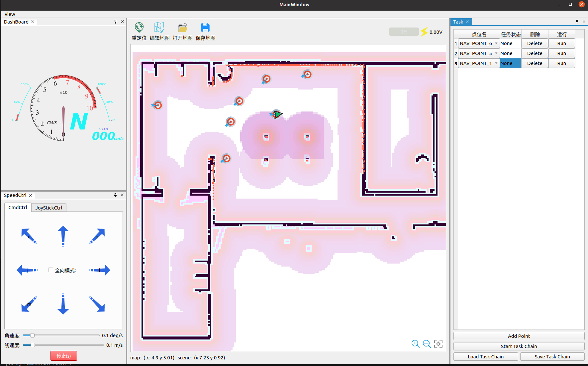
 


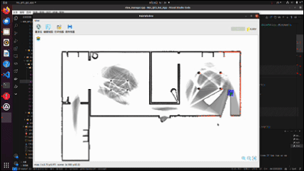

基于flutter的ROS1/ROS2跨平台移动机器人人机交互软件已正式开源:

如有需要请移步至[ROS_Flutter_Gui_App](https://github.com/chengyangkj/ROS_Flutter_Gui_App)

*目录*

<!-- TOC -->

- [一,Release 版本下载使用](#一release-版本下载使用)
- [二,编译](#二编译)
  - [1,环境安装](#1环境安装)
  - [2,克隆/下载本项目:](#2克隆下载本项目)
  - [3,编译项目](#3编译项目)
  - [4,运行项目](#4运行项目)
- [三,IDE配置说明(QtCreator/Vscode)](#三ide配置说明qtcreatorvscode)
    - [3.1 QtCreator打开项目教程](#31-qtcreator打开项目教程)
- [四,使用说明](#四使用说明)
  - [4.1,多机通信配置](#41多机通信配置)
  - [4.2,配置文件](#42配置文件)
  - [4.3,重定位位姿态发布](#43重定位位姿态发布)
  - [4.4,地图编辑](#44地图编辑)
    - [4.4.1 拓扑地图(机器人导航点设置)](#441-拓扑地图机器人导航点设置)
    - [4.4.2 橡皮擦](#442-橡皮擦)
    - [4.4.3 画笔](#443-画笔)
    - [4.4.4 线段绘制](#444-线段绘制)
    - [4.4.5 地图保存](#445-地图保存)
    - [4.4.6 地图加载](#446-地图加载)
  - [4.5,手动控制机器人](#45手动控制机器人)
  - [4.6,速度仪表盘](#46速度仪表盘)
  - [4.7,电池电量显示](#47电池电量显示)
  - [4.8 多点连续导航](#48-多点连续导航)
  - [4.9,相机图片显示](#49相机图片显示)
  - [4.10,机器人车身轮廓显示](#410机器人车身轮廓显示)
- [五,相关链接](#五相关链接)
- [六,相关教程及交流群](#六相关教程及交流群)

<!-- /TOC -->

# 一,Release 版本下载使用

如果您只想使用本软件,并不想了解具体的代码实现,用户可以选择下载编译好的Release版本，不用自行手动编译,下载即用

使用Release版本的前提:==系统ROS环境已安装,并且source到环境变量中==

本仓库使用CI自动生成各平台的Release版本(目前只有X86_64版本,Arm环境需要自行编译),在项目的[Release页面](https://github.com/chengyangkj/Ros_Qt5_Gui_App/releases)下载最新对应ROS版本的Release版本，理论上解压后即可使用。
使用方法:
在终端进入解压后的文件夹路径,执行如下命令:

```
sudo chmod a+x ./ros_qt5_gui_app
./ros_qt5_gui_app
```
如果Release版本下载后使用不了，可以参考[二,编译](#二编译)进行自行编译使用

# 二,编译


[](https://player.bilibili.com/player.html?isOutside=true&aid=1003134929&bvid=BV1ex4y1a7or&cid=1505288719&p=1)


>💡 注意，为了保证此项目同时兼容ROS1与ROS2，此项目不使用ROS1/ROS2的catkin_make/colcon构建系统进行够建，而是使用标准CMake进行构建，这也就意味着，本项目不会被ROS自动识别为功能包
可以参考以下教程从0开始构建/运行此项目:

## 1,环境安装 

理论上只需要安装如下基础包就可以编译此项目:

```
sudo apt-get update
sudo apt-get install qtbase5-private-dev libqt5svg5-dev libsdl-image1.2-dev libsdl1.2-dev -y
```

如果以上安装后还不行，可以执行如下指令安装全部依赖:

```
sudo apt-get install qtbase5-dev qt5-qmake qtbase5-dev-tools libqt5svg5-dev qtbase5-private-dev libeigen3-dev libgtest-dev libsdl-image1.2-dev libsdl1.2-dev -y
```

## 2,克隆/下载本项目:


```
mkdir -p ~/qt_ws
cd ~/qt_ws
git clone https://github.com/chengyangkj/Ros_Qt5_Gui_App
```

note:如果github下载过慢,可以使用以下指令从gitee拉取

```
git clone https://gitee.com/chengyangkj/Ros_Qt5_Gui_App

```

## 3,编译项目

可以手动执行如下命令进行编译(会根据环境变量自动识别ROS1还是ROS2环境):
```
cd ~/qt_ws/ROS2_Qt5_Gui_App
mkdir -p build
cd build
cmake ..
make

```
或者执行如下脚本手动指定ROS版本并进行一键编译:

```
cd ~/qt_ws/ROS2_Qt5_Gui_App

```
ROS1:

```
sh ./build_ros1.sh

```
ROS2

```
sh ./build_ros2.sh
```
## 4,运行项目

```
cd ~/qt_ws/ROS2_Qt5_Gui_App/build
./ros_qt5_gui_app

```

软件配置文件路径(运行一次软件后会自动生成在可执行程序相对路径下)

# 三,IDE配置说明(QtCreator/Vscode)


>💡  此部分为针对新手做的温馨提示,如果你已经是一个ROS/C++/Qt老手,可以跳过此部分


很多ROS初学者学习Qt都存在一个误区:没有搞清楚IDE与编译器的区别，像QtCreator，Vscode，CLion之类的均为IDE（[什么是IDE](https://www.zhihu.com/question/24833708)）
哪怕不用IDE，我们只用文本编辑器也能实现代码的编写(效率很低，没有代码提示)，编写之后使用make指令编译即可

实际上Ubuntu系统默认都自带的有Qt库,就比如前面的[3,编译项目](#3编译项目),并没有要求安装QtCreator,只需要使用apt-get安装一些系统缺失的,没有默认安装的qt库,就能正常编译通过

当然安装QtCreator时也会同时下载一些Qt库,但是他仅仅是下载,如果你没有将下载的库添加到环境变量中(通常也不建议自己将下载的qt库添加到环境变量中,这样需要处理系统默认的qt库与你添加的qt库的冲突问题),所以,在没有额外配置的情况下,虽然下载了QtCreator,但是在编译代码时用的还是系统默认的库.

那么,我们为什么还要去额外下载QtCreator呢?

因为我们需要使用QtCreator去编辑我们的(.ui),(.resource)文件，同时QtCreator还提供了代码提示，代码跳转等功能。但是这些功能，只要是IDE均有这个功能，我们通过Vscode/Clion安装一些插件，也是能够实现这些功能，只是QtCreator对自家的语言支持的比较好，比较方便

本项目所有的界面,都是在代码中去手动创建,如果打开代码中的mainwindow.ui可以发现什么都没有,因为所有界面都是代码动态创建添加上去的.

本人在开发本项目的流程为:
 - 使用系统的Qt库,如果需要使用的qt库不存在,则使用apt-get安装即可
 - 所有ui界面均使用代码动态创建,并添加到主窗口中,没有使用qtcreator拖拽生成
 - 项目的开发IDE使用vscode,仅安装了基础的c/c++插件做代码提示
 - 如果需要编辑资源文件(.qrc),手动打开qtcreator,再打开qrc文件进行编辑保存
 - 编译时在终端使用make指令进行编译
 - 运行时在终端使用./ros_qt5_gui_app指令进行运行

可以发现,开发此项目只有需要编辑资源文件时才会用到QtCreator(一般图片添加上去后也不会做频繁的编辑)

虽然本人开发使用的Vscode,但是为了方便部分习惯使用QtCreator做开发的用户,这里介绍下如果使用QtCreator作为IDE开发此项目:

### 3.1 QtCreator打开项目教程

首先需要按照[3,编译项目](#3编译项目)将项目成功编译,如果编译失败,则QtCreator打开后项目不会正常展开

本项目为标准CMake项目,因此按照在QtCreator中打开CMake项目的方式,打开本项目的根目录Cmakelist.txt即可(不区分ROS1/ROS2)

- 1.安装QtCreator

```
sudo apt-get install qtcreator

```
- 2.打开qtcreator

终端输入(必须终端打开):

```
qtcretor
```
打开后选择文件->打开文件或项目:

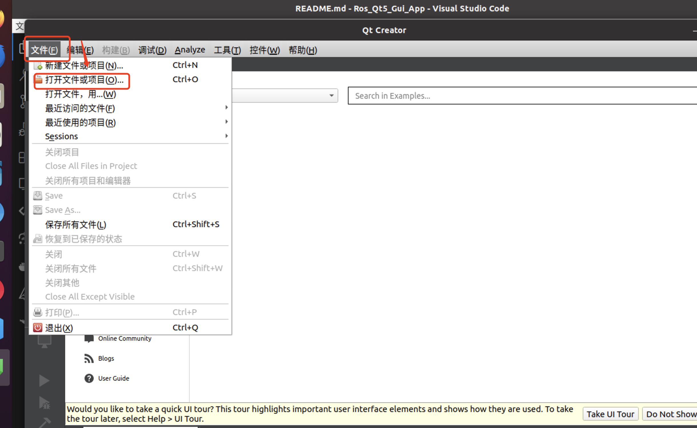

接着选择项目==根目录==下的Cmakelist.txt文件,点击打开即可:

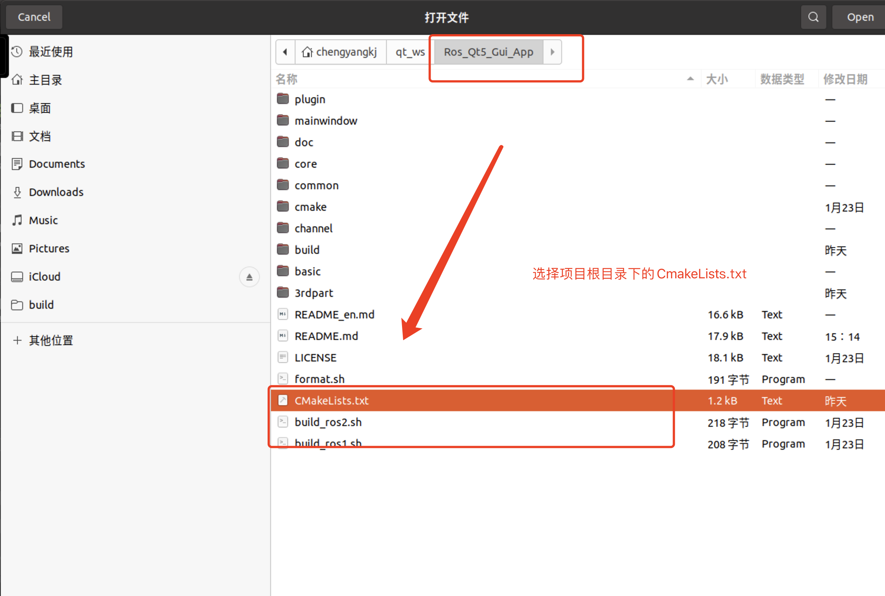

接着会自动识别我们前面编译的build目录,选择config:

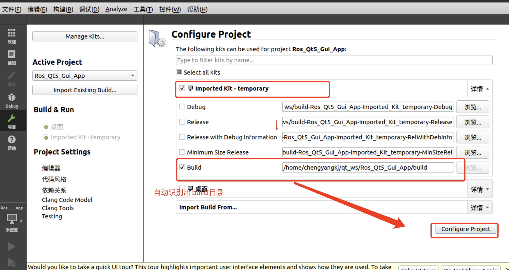

项目成功展开,点击绿色三角形编译并运行:

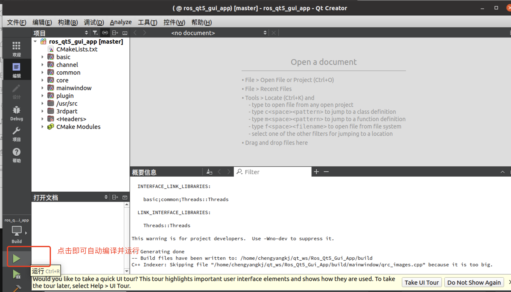

# 四,使用说明

## 4.1,多机通信配置

>💡  针对于ROS新手的温馨提示:此项配置,如果是单机使用即本软件运行在机器人身上,没有跨机器使用就不用配置，直接跳过即可.如果需要将本软件运行在自己的笔记本上,去连接远程的机器人的情况下需要进行配置


ROS1/ROS2的多机通信完全依赖ROS原生(环境变量添加ROS_MASTER_URI与ROS_IP/ROS_DOMAINID),不再由用户手动指定,减轻新手使用负担

ROS1:

配置参考：多机通讯教程[csdn 博客](https://blog.csdn.net/qq_38441692/article/details/98205852)

ROS2:

环境变量多机配置相同的ROS_DOMAINID

## 4.2,配置文件

第一次运行后，会在可执行程序同级目录生成config.json,修改此配置文件即可(需要注意Json格式),修改后重启生效,具体配置说明详见各功能的配置说明


## 4.3,重定位位姿态发布

程序可以拖动式的设置机器人初始位置（重定位）,相对于Rviz,拖动时可以实时查看激光匹配情况,重定位更加精准(左键按住拖动,右键旋转方向)


注意:如果设置无效,需要检查config.json中设置：

```
{
      "display_name": "Reloc",
      "topic": "/initialpose",
      "enable": true
}
```
为自己机器人监听的重定位Topic名称


## 4.4,地图编辑

程序支持地图编辑功能:


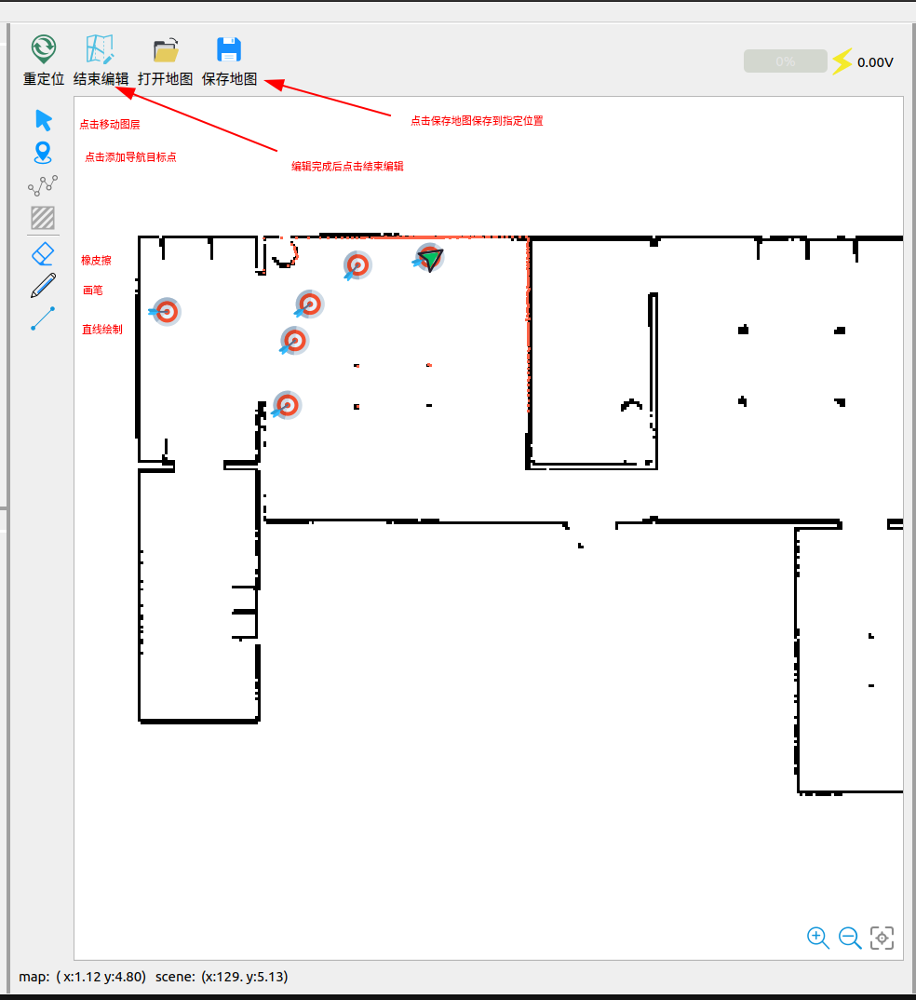

### 4.4.1 拓扑地图(机器人导航点设置)
并且程序支持拓扑地图功能,可以拖动式的设置机器人导航目标点（导航）使用gif说明如下:


注意:如果导航点位发布无响应设置无效,需要检查config.json中设置：

```
{
      "display_name": "NavGoal",
      "topic": "/move_base_simple/goal",
      "enable": true
}
```
为自己机器人监听的导航目标点Topic名称

### 4.4.2 橡皮擦

点击橡皮擦后,可以擦除地图中的障碍物,使用gif说明如下:
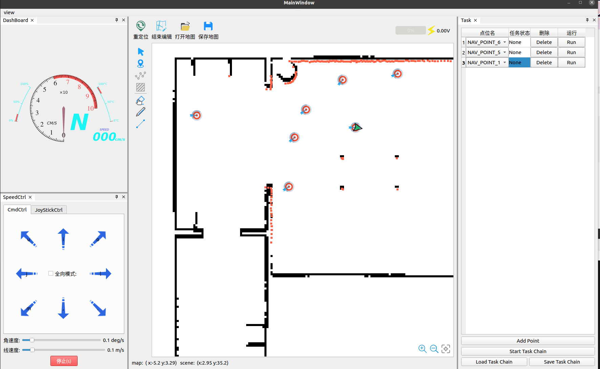

### 4.4.3 画笔
画笔功能


### 4.4.4 线段绘制
线段绘制


### 4.4.5 地图保存

地图编辑完成后并不会自动保存,需要点击保存按钮,保存地图到指定文件夹,如果需要在ROS中使用，需要将该地图替换到自己对应导航包的map中

目前保存地图有如下:

- *.pgm 图片数据
- *.yaml 地图描述文件
- *.topology 程序自定义的拓扑地图 保存了点位等信息


### 4.4.6 地图加载

地图加载同理 用户选择对应的PGM地图文件即可加载，并进行编辑

## 4.5,手动控制机器人

软件支持发布实时速度到底盘:

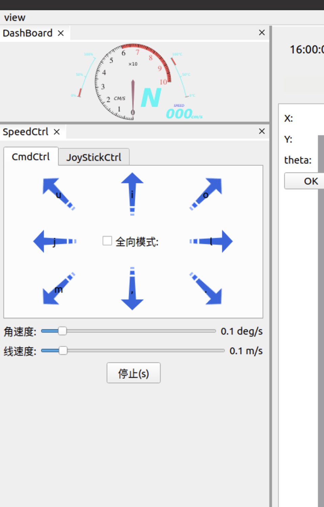

对应按钮上的文字，可以由键盘对应按钮同步调用

注意:如果设置无效,需要检查config.json中设置：

```
{
      "display_name": "Speed",
      "topic": "/cmd_vel",
      "enable": true
}

```
为实际机器人监听的速度控制话题

## 4.6,速度仪表盘

软件支持实时显示机器人速度:


注意:如果设置无效,需要检查config.json中设置：

```
{
      "display_name": "Odometry",
      "topic": "/odom",
      "enable": true
}
```

为机器人时机发布的里程计话题

## 4.7,电池电量显示

软件支持实时显示机器人电量,在配置中配置话题名，电池电量的Topic类型为:sensor_msgs::BatteryState

```
{
      "display_name": "Battery",
      "topic": "/battery",
      "enable": true
}
```


## 4.8 多点连续导航

软件支持多点连续导航,使用方法如下:

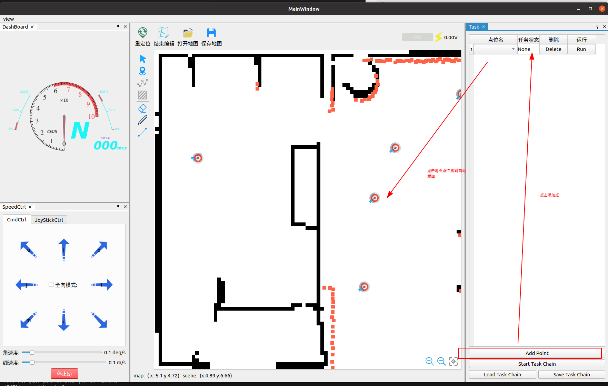

点击Start Task Chain即可开始任务:


## 4.9,相机图片显示

软件支持实时显示机器人相机图片,在配置中配置话题名及location:

```
  "images": [ ], //图片列表 支持多路 配置后自动创建界面

```

软件移植了rqt image view的图片显示功能,支持实时显示多路机器人相机图片,在配置中配置话题名

配置demo:

```

  "images": [
    {
      "location": "front",
      "topic": "/camera/rgb/image_raw",
      "enable": true
    },
    {
      "location": "front/depth",
      "topic": "/camera/depth/image_raw",
      "enable": true
    }
  ],

```


## 4.10,机器人车身轮廓显示

车身尺寸位于配置:"robot_shape_config":

``` 

  "robot_shape_config": {
    "shaped_points": [],  //轮廓点
    "is_ellipse": false,  //轮廓是否为椭圆
    "color": "0x0000FF",   //轮廓填充颜色
    "opacity": 0.5     //轮廓透明度
  }

```

配置前，首先需要以车中心为原点，使用如下坐标系计算车身轮廓的每个点(单位m)，支持异形车身:

```

                    ^x
                    |
                    |
                    |
          (0.5,0.5) |     (0.5,-0.5)
            +---------------+
            |       |       |
            |       |       |
            |       |       |
<----------------------------------------+
y           |       |       |
            |       |       |
            |       |       |
            |       |       |
            +---------------+
        (-0.5,0.5)  |       (-0.5,-0.5)
                    |
                    |


```

随意找一个点作为起始点,按照顺时针,依次填下每个点

配置demo:

- 1m*1m车身:

```
  "robot_shape_config": {
    "shaped_points": [
      {
        "x": 0.5,
        "y": 0.5
      },
      {
        "x": 0.5,
        "y": -0.5
      },
      {
        "x": -0.5,
        "y": -0.5
      },
      {
        "x": -0.5,
        "y": 0.5
      }
    ],
    "is_ellipse": false,
    "color": "0x00000FF",
    "opacity": 0.5
  }

```

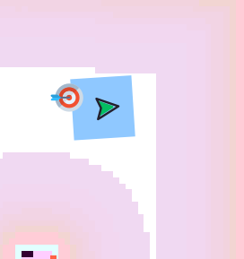

- 1m*1m 圆形车身:

is_ellipse=true

```
  "robot_shape_config": {
    "shaped_points": [
      {
        "x": 0.5,
        "y": 0.5
      },
      {
        "x": 0.5,
        "y": -0.5
      },
      {
        "x": -0.5,
        "y": -0.5
      },
      {
        "x": -0.5,
        "y": 0.5
      }
    ],
    "is_ellipse": true,
    "color": "0x00000FF",
    "opacity": 0.5
  }

```


- 异形车身:
  
```
  "robot_shape_config": {
    "shaped_points": [
      {
        "x": 0.5,
        "y": 0.5
      },
      {
        "x": 1,
        "y": 0
      },
      {
        "x": 0.5,
        "y": -0.5
      },
      {
        "x": -0.5,
        "y": -0.5
      },
      {
        "x": -0.5,
        "y": 0.5
      }
    ],
    "is_ellipse": false,
    "color": "0x00000FF",
    "opacity": 0.5
  }

```

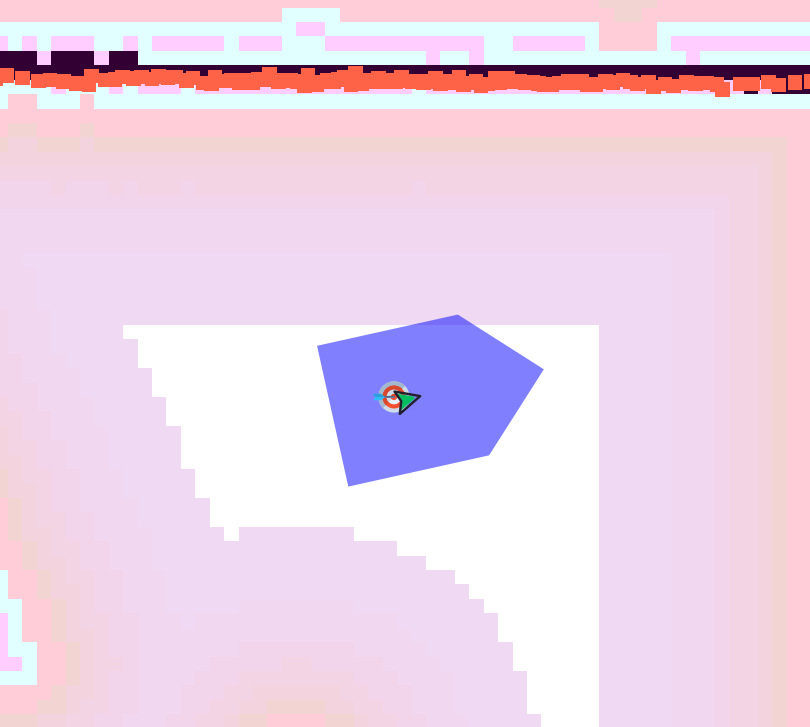

# 五,相关链接


| 链接名                                                                             | 支持平台                  | 功能                                                                                                   |
| ---------------------------------------------------------------------------------- | ------------------------- | ------------------------------------------------------------------------------------------------------ |
| [master](https://github.com/chengyangkj/Ros_Qt5_Gui_App/tree/master)               | Win10 Ubuntu              | ROS + QWidget + QGraphicsview自绘制可视化界面显示                                                      |
| [qml_hmi](https://github.com/chengyangkj/Ros_Qt5_Gui_App/tree/qml_hmi)             | Win10 Ubuntu              | ROS + QML + C++混合编程，qml自绘制地图，激光雷达可视化显示等demo                                       |
| [simple](https://github.com/chengyangkj/Ros_Qt5_Gui_App/tree/simple)               | Win10 Ubuntu              | ROS + QWidget + Librviz进行可视化显示，为《ROS人机交互软件开发》系列课程中实现的版本，CSDN博客例程版本 |
| [rviz_tree](https://github.com/chengyangkj/Ros_Qt5_Gui_App/tree/rviz_tree)         | Win10 Ubuntu              | ROS + QWidget + Librviz原生图层Api实现图层管理，不需手动创建图层                                       |
| [ros_qt_demo](https://github.com/chengyangkj/Ros_Qt5_Gui_App/tree/ros_qt_demo)     | Win10 Ubuntu              | cakin_create_qt_pkg 创建的原始包，cmakelist.txt已配置好改为qt5，可以直接编译运行                       |
| [ros2_qt_demo](https://github.com/chengyangkj/ros2_qt_demo)                        | ROS2                      | 在ROS2平台上运行的qt demo包，cmakelist.txt已配置好改为qt5，可以直接colcon build 编译使用               |
| [ROS2_Qt5_Gui_App](https://github.com/chengyangkj/ROS2_Qt5_Gui_App)                | ROS2                      | 与本仓库代码完全相同/停止维护                                                                          |
| [Flutter App](https://github.com/chengyangkj/Ros_Qt5_Gui_App/tree/ros_flutter_app) | 基于flutter实现多平台运行 | 逐步推进.....                                                                                          |


# 六,相关教程及交流群

 **本系列教程文章专栏:**

[ROS机器人GUI程序开发](https://blog.csdn.net/qq_38441692/category_9863968.html)
[ROS2 Qt21天训练营(关注古月学院,不定期开营)](https://class.guyuehome.com/)
 **本系列课程已上线古月学院，欢迎感兴趣的小伙伴订阅：**

 1. [ROS Qt开发环境搭建以及基础知识介绍](https://class.guyuehome.com/detail/p_5eba414d58533_Uh4XTbPi/6)
 2. [ROS人机交互软件的界面开发](https://class.guyuehome.com/detail/p_5ec490a8d7bd7_b7ucPqUs/6)
 3. [ROS Rviz组件开发方法](https://class.guyuehome.com/detail/p_5edf2d27a1942_foy4nqci/6)
 4. [如何实现ROS windows人机交互软件](https://class.guyuehome.com/detail/p_5fc5ab97e4b04db7c091f475/6)
 


**开发交流QQ群：** 797497206
