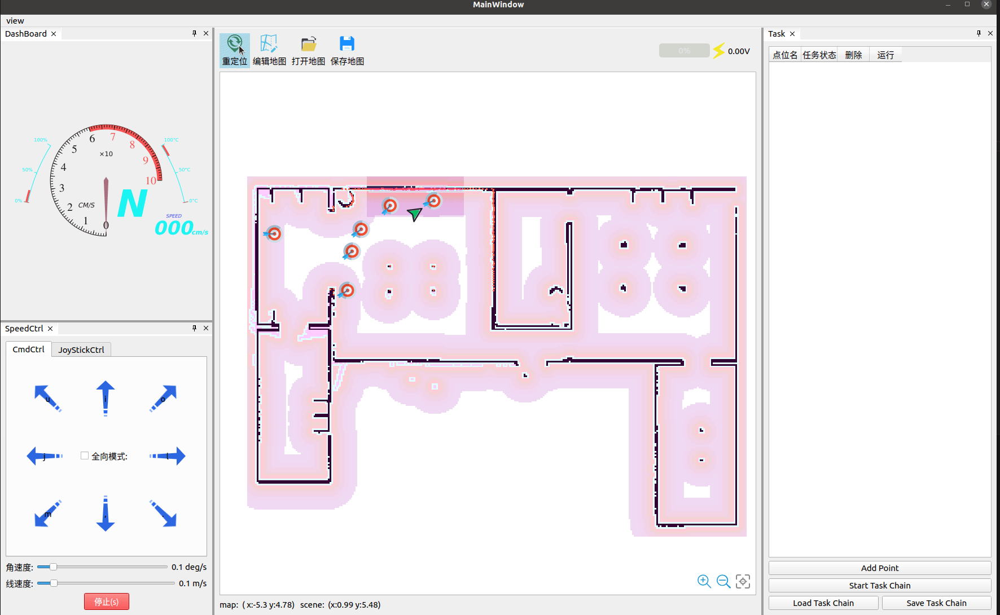
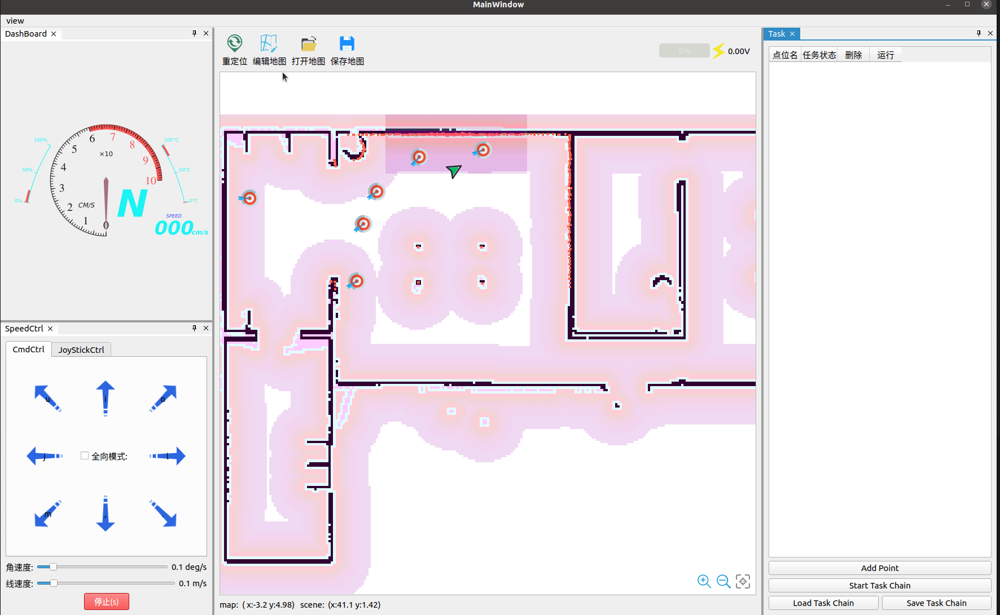

<!--
 * @Author: chengyangkj chengyangkj@qq.com
 * @Date: 2023-09-02 07:23:43
 * @LastEditors: chengyangkj chengyangkj@qq.com
 * @LastEditTime: 2023-10-06 14:03:03
 * @FilePath: /ROS2_Qt5_Gui_App/README.md
-->
[中文](./README.md) | English

## Lightweight ROS1/ROS2 Mobile Robot Human-Machine Interaction Software


<a href="http://qm.qq.com/cgi-bin/qm/qr?_wv=1027&k=mvzoO6tJQtu0ZQYa_itHW7JrT0i4OCdK&authKey=exOT53pUpRG85mwuSMstWKbLlnrme%2FEuJE0Rt%2Fw6ONNvfHqftoWMay03mk1Qi7yv&noverify=0&group_code=797497206">

</a>


<!-- 
<a href="https://www.bilibili.com/video/BV14h4y1w7TC">

</a>
<a href="https://www.bilibili.com/video/BV11h4y1y74H">

</a>
-->


This project is developed based on Qt5 and built using Module Cmake. It can be used in both ROS1 and ROS2 systems using the same set of code.

During compilation, the software will automatically identify the ROS1/ROS2 environment variables and build accordingly, achieving isolation of ROS communication and interface.

All features of the software are self-drawn and implemented, making it easy to run on some low-performance edge devices.

Currently, the software can achieve:

  - ROS1/ROS2 communication
  - Global map display
  - Global/local cost map display
  - Real-time robot position display
  - Real-time robot speed display
  - Manual robot control
  - Robot relocation
  - Robot navigation single point goal publishing
  - Global/local planned trajectory display for the robot
  - Robot topological map functionality, multi-navigation point single-point navigation
  - Battery level display
  
Planned but not yet implemented (TODO List):

  - Robot map editor functionality
  - Robot topological map multi-point continuous navigation/topological map route drawing
  - Robot navigation task chain
  - Implementation of communication channel based on protobuf (custom communication protocol, completely freeing from ROS communication mechanism, achieving cross-platform operation of the software)
  - Bird's eye view
  - 3D view display based on OpenGL
  - Camera image display


This repository's mirror link for Chinese users: [gitee](https://gitee.com/chengyangkj/Ros_Qt5_Gui_App)

This project has been integrated into CI to ensure the availability of multiple ROS versions/system versions, continuous integration, continuous optimization and iteration......

  <picture>
    <source media="(prefers-color-scheme: dark)" srcset="https://api.star-history.com/svg?repos=chengyangkj/Ros_Qt5_Gui_App&type=Timeline&theme=dark" />
    <source media="(prefers-color-scheme: light)" srcset="https://api.star-history.com/svg?repos=chengyangkj/Ros_Qt5_Gui_App&type=Timeline" />
    
  </picture>

## Project Screenshots


<!-- TOC -->
## Table of Contents

- [Environment Installation](#environment-installation)
- [Compilation](#compilation)
  - [Clone/Download the Project:](#clonedownload-the-project)
  - [Compile the Project](#compile-the-project)
  - [Run the Project](#run-the-project)
- [Usage Instructions](#usage-instructions)
    - [Multi-Machine Communication Configuration](#multi-machine-communication-configuration)
    - [Configuration File](#configuration-file)
    - [Relocation Pose Publishing](#relocation-pose-publishing)
    - [Setting Navigation Target Points](#setting-navigation-target-points)
    - [Manual Robot Control](#manual-robot-control)
    - [Speed Dashboard](#speed-dashboard)
    - [Battery Level Display](#battery-level-display)
- [Related Links](#related-links)
- [Related Tutorials and Discussion Groups](#related-tutorials-and-discussion-groups)

<!-- /TOC -->


# Environment Installation 

In theory, only the following basic packages need to be installed to compile this project:

```
sudo apt-get update
sudo apt-get install qtbase5-private-dev -y
```

If the above installation is still not working, you can execute the following command to install all dependencies:

```
sudo apt-get install qtbase5-dev qt5-qmake qtbase5-dev-tools qtbase5-private-dev libeigen3-dev libgtest-dev -y

```

# Compilation


Note that, to ensure that this project is compatible with both ROS1 and ROS2, this project does not use the catkin_make/colcon build system of ROS1/ROS2 for building. Instead, it uses standard CMake for building. This also means that this project will not be automatically recognized as a functional package by ROS.
You can refer to the following tutorial to build/run this project from scratch:


## Clone/Download the Project:


```
mkdir -p ~/qt_ws
cd ~/qt_ws
git clone https://github.com/chengyangkj/Ros_Qt5_Gui_App
```

Note: If downloading from GitHub is slow, you can use the following command to pull from Gitee

```
git clone https://gitee.com/chengyangkj/Ros_Qt5_Gui_App

```

## Compile the Project

You can manually execute the following commands to compile the project (it will automatically identify whether it is a ROS1 or ROS2 environment based on environment variables):

```
cd ~/qt_ws/ROS2_Qt5_Gui_App
mkdir -p build
cd build
cmake ..
make

```
Or you can execute the following script to specify the ROS version and perform a one-click compilation:

```
cd ~/qt_ws/ROS2_Qt5_Gui_App

```
ROS1:

```
sh ./build_ros1.sh

```
ROS2

```
sh ./build_ros2.sh
```
## Run the Project

```
cd ~/qt_ws/ROS2_Qt5_Gui_App/build
./ros_qt5_gui_app

```

The software configuration file path (generated after running the software once) is located at:

```

~/qt_ws/ROS2_Qt5_Gui_App/build/config.ini

```

# Usage Instructions

### Multi-Machine Communication Configuration

For ROS beginners, a warm reminder: This configuration is not required if the software is running on a single machine, such as on the robot itself, and there is no need for cross-machine usage. However, if the software needs to be run on your own notebook to connect to a remote robot, configuration is needed. ROS1/ROS2 multi-machine communication relies entirely on ROS native (environment variables adding ROS_MASTER_URI and ROS_IP/ROS_DOMAINID), and is no longer manually specified by the user, reducing the burden for new users.

ROS1:

Configuration reference: [Multi-machine communication tutorial](https://blog.csdn.net/qq_38441692/article/details/98205852)

ROS2:

Environment variable multi-machine configuration is the same as ROS_DOMAINID

### Configuration File

After the first run, a config.ini file will be generated in the same directory as the executable. Modify this configuration file to take effect. For specific configuration instructions, please refer to [configuration file description](./doc/config.md)


### Relocation Pose Publishing

The program allows for drag-and-drop setting of the initial position of the robot (relocation), and relative to Rviz, real-time laser matching can be viewed during dragging, resulting in more accurate relocation.




Note: If the settings are invalid, check the setting in config.ini:

```
[Reloc]
Topic=/initialpose  
```
Replace "/initialpose" with the topic name your robot listens to for relocation.

### Setting Navigation Target Points

The program allows for drag-and-drop setting of the robot's navigation target points (navigation). Use the instructions below to set the navigation target points:




Note: If the settings are invalid, check the setting in config.ini:

```
[NavGoal]
Topic=/move_base_simple/goal
```
Replace "/move_base_simple/goal" with the topic name your robot listens to for navigation target points.

### Manual Robot Control

The software supports publishing real-time velocity to the robot base:


The text on the corresponding buttons can be synchronized with the keyboard buttons.

Note: If the settings are invalid, check the setting in config.ini:

```
[Speed]
Topic=/cmd_vel

```
Replace "/cmd_vel" with the actual topic your robot listens to for speed control.

### Speed Dashboard

The software supports real-time display of the robot's speed:


Note: If the settings are invalid, check the setting in config.ini:

```
[Odometry]
Topic=/odom
```

Replace "/odom" with the topic where your robot publishes odometry.

### Battery Level Display

The software supports real-time display of the robot's battery level. Configure the topic name for battery level in the configuration file. The topic type for battery level is sensor_msgs::BatteryState.

```
[Battery]
Topic=/battery
```


# Related Links

| Link                                                                               | Supported Platforms                           | Features                                                                                                                                   |
| ---------------------------------------------------------------------------------- | --------------------------------------------- | ------------------------------------------------------------------------------------------------------------------------------------------ |
| [master](https://github.com/chengyangkj/Ros_Qt5_Gui_App/tree/master)               | Win10 Ubuntu                                  | ROS + QWidget + QGraphicsview self-drawn visualization interface display                                                                   |
| [qml_hmi](https://github.com/chengyangkj/Ros_Qt5_Gui_App/tree/qml_hmi)             | Win10 Ubuntu                                  | ROS + QML + C++ mixed programming, qml self-drawn map, visual display of lidar, and other demos                                            |
| [simple](https://github.com/chengyangkj/Ros_Qt5_Gui_App/tree/simple)               | Win10 Ubuntu                                  | ROS + QWidget + Librviz for visualization, a version implemented in the "ROS Human-Machine Interaction Software Development" series course |
| [rviz_tree](https://github.com/chengyangkj/Ros_Qt5_Gui_App/tree/rviz_tree)         | Win10 Ubuntu                                  | ROS + QWidget + Librviz original layer API for layer management, no need to create layers manually                                         |
| [ros_qt_demo](https://github.com/chengyangkj/Ros_Qt5_Gui_App/tree/ros_qt_demo)     | Win10 Ubuntu                                  | Original package created by cakin_create_qt_pkg, cmakelist.txt configured for qt5, can be compiled and run directly                        |
| [ros2_qt_demo](https://github.com/chengyangkj/ros2_qt_demo)                        | ROS2                                          | Qt demo package running on ROS2 platform, cmakelist.txt configured for qt5, can be built using colcon                                      |
| [ROS2_Qt5_Gui_App](https://github.com/chengyangkj/ROS2_Qt5_Gui_App)                | ROS2                                          | Identical to this repository/No longer maintained                                                                                          |
| [Flutter App](https://github.com/chengyangkj/Ros_Qt5_Gui_App/tree/ros_flutter_app) | Based on flutter for multi-platform operation | In progress.....                                                                                                                           |


# Related Tutorials and Discussion Groups

 **Series of tutorial articles:**

[ROS Robot GUI Program Development](https://blog.csdn.net/qq_38441692/category_9863968.html)

 **This series of courses has been launched on Guyue Academy, welcome interested friends to subscribe:**

 1. [ROS Qt development environment setup and basic knowledge introduction](https://class.guyuehome.com/detail/p_5eba414d58533_Uh4XTbPi/6)
 2. [Interface development of ROS Human-Machine Interaction Software](https://class.guyuehome.com/detail/p_5ec490a8d7bd7_b7ucPqUs/6)
 3. [ROS Rviz component development method](https://class.guyuehome.com/detail/p_5edf2d27a1942_foy4nqci/6)
 4. [How to implement ROS Windows Human-Machine Interaction Software](https://class.guyuehome.com/detail/p_5fc5ab97e4b04db7c091f475/6)
 


**Development exchange QQ group:** 797497206
